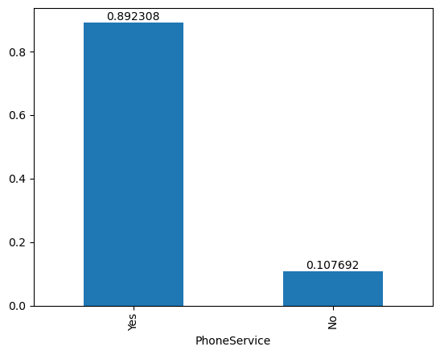

### Case Study


```python
customer = pd.read_csv('./Upgrad case study/customer.csv')
customer.head()
```


<div>
<style scoped>
    .dataframe tbody tr th:only-of-type {
        vertical-align: middle;
    }

    .dataframe tbody tr th {
        vertical-align: top;
    }

    .dataframe thead th {
        text-align: right;
    }
</style>
<table border="1" class="dataframe">
  <thead>
    <tr style="text-align: right;">
      <th></th>
      <th>CustomerID</th>
      <th>Gender</th>
      <th>SeniorCitizen</th>
      <th>Partner</th>
      <th>Dependents</th>
    </tr>
  </thead>
  <tbody>
    <tr>
      <th>0</th>
      <td>3668-QPYBK</td>
      <td>Male</td>
      <td>No</td>
      <td>No</td>
      <td>No</td>
    </tr>
    <tr>
      <th>1</th>
      <td>9237-HQITU</td>
      <td>Female</td>
      <td>No</td>
      <td>No</td>
      <td>Yes</td>
    </tr>
    <tr>
      <th>2</th>
      <td>9305-CDSKC</td>
      <td>Female</td>
      <td>No</td>
      <td>No</td>
      <td>Yes</td>
    </tr>
    <tr>
      <th>3</th>
      <td>7892-POOKP</td>
      <td>Female</td>
      <td>No</td>
      <td>Yes</td>
      <td>Yes</td>
    </tr>
    <tr>
      <th>4</th>
      <td>0280-XJGEX</td>
      <td>Male</td>
      <td>No</td>
      <td>No</td>
      <td>Yes</td>
    </tr>
  </tbody>
</table>
</div>


```python
account = pd.read_csv('./Upgrad case study/cust_account.csv')
account.head()
```


<div>
<style scoped>
    .dataframe tbody tr th:only-of-type {
        vertical-align: middle;
    }

    .dataframe tbody tr th {
        vertical-align: top;
    }

    .dataframe thead th {
        text-align: right;
    }
</style>
<table border="1" class="dataframe">
  <thead>
    <tr style="text-align: right;">
      <th></th>
      <th>Account_id</th>
      <th>Tenure</th>
      <th>Contract</th>
      <th>PaymentMethod</th>
      <th>PaperlessBilling</th>
      <th>MonthlyCharges</th>
      <th>TotalCharges</th>
    </tr>
  </thead>
  <tbody>
    <tr>
      <th>0</th>
      <td>3668-QPYBK</td>
      <td>2</td>
      <td>Month-to-month</td>
      <td>Mailed check</td>
      <td>Yes</td>
      <td>53.85</td>
      <td>108.15</td>
    </tr>
    <tr>
      <th>1</th>
      <td>9237-HQITU</td>
      <td>2</td>
      <td>Month-to-month</td>
      <td>Electronic check</td>
      <td>Yes</td>
      <td>70.70</td>
      <td>151.65</td>
    </tr>
    <tr>
      <th>2</th>
      <td>9305-CDSKC</td>
      <td>8</td>
      <td>Month-to-month</td>
      <td>Electronic check</td>
      <td>Yes</td>
      <td>99.65</td>
      <td>820.5</td>
    </tr>
    <tr>
      <th>3</th>
      <td>7892-POOKP</td>
      <td>28</td>
      <td>Month-to-month</td>
      <td>Electronic check</td>
      <td>Yes</td>
      <td>104.80</td>
      <td>3046.05</td>
    </tr>
    <tr>
      <th>4</th>
      <td>0280-XJGEX</td>
      <td>49</td>
      <td>Month-to-month</td>
      <td>Bank transfer (automatic)</td>
      <td>Yes</td>
      <td>103.70</td>
      <td>5036.3</td>
    </tr>
  </tbody>
</table>
</div>


```python
service = pd.read_csv('./Upgrad case study/cust_services.csv')
service.head()
```


<div>
<style scoped>
    .dataframe tbody tr th:only-of-type {
        vertical-align: middle;
    }

    .dataframe tbody tr th {
        vertical-align: top;
    }

    .dataframe thead th {
        text-align: right;
    }
</style>
<table border="1" class="dataframe">
  <thead>
    <tr style="text-align: right;">
      <th></th>
      <th>Cust_ID</th>
      <th>PhoneService</th>
      <th>MultipleLines</th>
      <th>InternetService</th>
      <th>OnlineSecurity</th>
      <th>OnlineBackup</th>
      <th>DeviceProtection</th>
      <th>TechSupport</th>
      <th>StreamingTV</th>
      <th>StreamingMovies</th>
    </tr>
  </thead>
  <tbody>
    <tr>
      <th>0</th>
      <td>3668-QPYBK</td>
      <td>Yes</td>
      <td>No</td>
      <td>DSL</td>
      <td>Yes</td>
      <td>Yes</td>
      <td>No</td>
      <td>No</td>
      <td>No</td>
      <td>No</td>
    </tr>
    <tr>
      <th>1</th>
      <td>9237-HQITU</td>
      <td>Yes</td>
      <td>No</td>
      <td>Fiber optic</td>
      <td>No</td>
      <td>No</td>
      <td>No</td>
      <td>No</td>
      <td>No</td>
      <td>No</td>
    </tr>
    <tr>
      <th>2</th>
      <td>9305-CDSKC</td>
      <td>Yes</td>
      <td>Yes</td>
      <td>Fiber optic</td>
      <td>No</td>
      <td>No</td>
      <td>Yes</td>
      <td>No</td>
      <td>Yes</td>
      <td>Yes</td>
    </tr>
    <tr>
      <th>3</th>
      <td>7892-POOKP</td>
      <td>Yes</td>
      <td>Yes</td>
      <td>Fiber optic</td>
      <td>No</td>
      <td>No</td>
      <td>Yes</td>
      <td>Yes</td>
      <td>Yes</td>
      <td>Yes</td>
    </tr>
    <tr>
      <th>4</th>
      <td>0280-XJGEX</td>
      <td>Yes</td>
      <td>Yes</td>
      <td>Fiber optic</td>
      <td>No</td>
      <td>Yes</td>
      <td>Yes</td>
      <td>No</td>
      <td>Yes</td>
      <td>Yes</td>
    </tr>
  </tbody>
</table>
</div>


```python
churn = pd.read_csv('./Upgrad case study/cust_churn.csv')
churn.head()
```


<div>
<style scoped>
    .dataframe tbody tr th:only-of-type {
        vertical-align: middle;
    }

    .dataframe tbody tr th {
        vertical-align: top;
    }

    .dataframe thead th {
        text-align: right;
    }
</style>
<table border="1" class="dataframe">
  <thead>
    <tr style="text-align: right;">
      <th></th>
      <th>Id</th>
      <th>Churn</th>
    </tr>
  </thead>
  <tbody>
    <tr>
      <th>0</th>
      <td>3668-QPYBK</td>
      <td>Yes</td>
    </tr>
    <tr>
      <th>1</th>
      <td>9237-HQITU</td>
      <td>Yes</td>
    </tr>
    <tr>
      <th>2</th>
      <td>9305-CDSKC</td>
      <td>Yes</td>
    </tr>
    <tr>
      <th>3</th>
      <td>7892-POOKP</td>
      <td>Yes</td>
    </tr>
    <tr>
      <th>4</th>
      <td>0280-XJGEX</td>
      <td>Yes</td>
    </tr>
  </tbody>
</table>
</div>


```python
loc = pd.read_csv('./Upgrad case study/cust_loc.csv')
loc.head()
```


<div>
<style scoped>
    .dataframe tbody tr th:only-of-type {
        vertical-align: middle;
    }

    .dataframe tbody tr th {
        vertical-align: top;
    }

    .dataframe thead th {
        text-align: right;
    }
</style>
<table border="1" class="dataframe">
  <thead>
    <tr style="text-align: right;">
      <th></th>
      <th>Cust_ID</th>
      <th>State</th>
      <th>Latitude</th>
      <th>Longitude</th>
      <th>ZipCode</th>
    </tr>
  </thead>
  <tbody>
    <tr>
      <th>0</th>
      <td>3668-QPYBK</td>
      <td>California</td>
      <td>33.964131</td>
      <td>-118.272783</td>
      <td>90003</td>
    </tr>
    <tr>
      <th>1</th>
      <td>9237-HQITU</td>
      <td>California</td>
      <td>34.059281</td>
      <td>-118.307420</td>
      <td>90005</td>
    </tr>
    <tr>
      <th>2</th>
      <td>9305-CDSKC</td>
      <td>California</td>
      <td>34.048013</td>
      <td>-118.293953</td>
      <td>90006</td>
    </tr>
    <tr>
      <th>3</th>
      <td>7892-POOKP</td>
      <td>California</td>
      <td>34.062125</td>
      <td>-118.315709</td>
      <td>90010</td>
    </tr>
    <tr>
      <th>4</th>
      <td>0280-XJGEX</td>
      <td>California</td>
      <td>34.039224</td>
      <td>-118.266293</td>
      <td>90015</td>
    </tr>
  </tbody>
</table>
</div>


### Create database and tables


```python
conn = sqlite3.connect("churn.db")
cur = conn.cursor()
```


```python
# data type in pyhton and sqlite are different, but it is automatically adjusted
customer.to_sql('customer', conn, if_exists = 'replace', index = False)
```


    ---------------------------------------------------------------------------

    OperationalError                          Traceback (most recent call last)

    File ~\anaconda3\Lib\site-packages\pandas\io\sql.py:2674, in SQLiteDatabase.execute(self, sql, params)
       2673 try:
    -> 2674     cur.execute(sql, *args)
       2675     return cur
    

    OperationalError: database is locked

    
    The above exception was the direct cause of the following exception:
    

    DatabaseError                             Traceback (most recent call last)

    Cell In[46], line 2
          1 # data type in pyhton and sqlite are different, but it is automatically adjusted
    ----> 2 customer.to_sql('customer', conn, if_exists = 'replace', index = False)
    

    File ~\anaconda3\Lib\site-packages\pandas\util\_decorators.py:333, in deprecate_nonkeyword_arguments.<locals>.decorate.<locals>.wrapper(*args, **kwargs)
        327 if len(args) > num_allow_args:
        328     warnings.warn(
        329         msg.format(arguments=_format_argument_list(allow_args)),
        330         FutureWarning,
        331         stacklevel=find_stack_level(),
        332     )
    --> 333 return func(*args, **kwargs)
    

    File ~\anaconda3\Lib\site-packages\pandas\core\generic.py:3087, in NDFrame.to_sql(self, name, con, schema, if_exists, index, index_label, chunksize, dtype, method)
       2889 """
       2890 Write records stored in a DataFrame to a SQL database.
       2891 
       (...)
       3083 [(1,), (None,), (2,)]
       3084 """  # noqa: E501
       3085 from pandas.io import sql
    -> 3087 return sql.to_sql(
       3088     self,
       3089     name,
       3090     con,
       3091     schema=schema,
       3092     if_exists=if_exists,
       3093     index=index,
       3094     index_label=index_label,
       3095     chunksize=chunksize,
       3096     dtype=dtype,
       3097     method=method,
       3098 )
    

    File ~\anaconda3\Lib\site-packages\pandas\io\sql.py:842, in to_sql(frame, name, con, schema, if_exists, index, index_label, chunksize, dtype, method, engine, **engine_kwargs)
        837     raise NotImplementedError(
        838         "'frame' argument should be either a Series or a DataFrame"
        839     )
        841 with pandasSQL_builder(con, schema=schema, need_transaction=True) as pandas_sql:
    --> 842     return pandas_sql.to_sql(
        843         frame,
        844         name,
        845         if_exists=if_exists,
        846         index=index,
        847         index_label=index_label,
        848         schema=schema,
        849         chunksize=chunksize,
        850         dtype=dtype,
        851         method=method,
        852         engine=engine,
        853         **engine_kwargs,
        854     )
    

    File ~\anaconda3\Lib\site-packages\pandas\io\sql.py:2850, in SQLiteDatabase.to_sql(self, frame, name, if_exists, index, index_label, schema, chunksize, dtype, method, engine, **engine_kwargs)
       2839             raise ValueError(f"{col} ({my_type}) not a string")
       2841 table = SQLiteTable(
       2842     name,
       2843     self,
       (...)
       2848     dtype=dtype,
       2849 )
    -> 2850 table.create()
       2851 return table.insert(chunksize, method)
    

    File ~\anaconda3\Lib\site-packages\pandas\io\sql.py:988, in SQLTable.create(self)
        986     raise ValueError(f"Table '{self.name}' already exists.")
        987 if self.if_exists == "replace":
    --> 988     self.pd_sql.drop_table(self.name, self.schema)
        989     self._execute_create()
        990 elif self.if_exists == "append":
    

    File ~\anaconda3\Lib\site-packages\pandas\io\sql.py:2872, in SQLiteDatabase.drop_table(self, name, schema)
       2870 def drop_table(self, name: str, schema: str | None = None) -> None:
       2871     drop_sql = f"DROP TABLE {_get_valid_sqlite_name(name)}"
    -> 2872     self.execute(drop_sql)
    

    File ~\anaconda3\Lib\site-packages\pandas\io\sql.py:2686, in SQLiteDatabase.execute(self, sql, params)
       2683     raise ex from inner_exc
       2685 ex = DatabaseError(f"Execution failed on sql '{sql}': {exc}")
    -> 2686 raise ex from exc
    

    DatabaseError: Execution failed on sql 'DROP TABLE "customer"': database is locked


```python
account.to_sql('account', conn, if_exists = 'replace', index = False)
```


```python
service.to_sql('service', conn, if_exists = 'replace', index = False)
```


    7043


```python
churn.to_sql('churn', conn, if_exists = 'replace', index = False)
```


    7043


```python
loc.to_sql('location', conn, if_exists = 'replace', index = False)
```


    ---------------------------------------------------------------------------

    OperationalError                          Traceback (most recent call last)

    File ~\anaconda3\Lib\site-packages\pandas\io\sql.py:2674, in SQLiteDatabase.execute(self, sql, params)
       2673 try:
    -> 2674     cur.execute(sql, *args)
       2675     return cur
    

    OperationalError: database is locked

    
    The above exception was the direct cause of the following exception:
    

    DatabaseError                             Traceback (most recent call last)

    Cell In[51], line 1
    ----> 1 loc.to_sql('location', conn, if_exists = 'replace', index = False)
    

    File ~\anaconda3\Lib\site-packages\pandas\util\_decorators.py:333, in deprecate_nonkeyword_arguments.<locals>.decorate.<locals>.wrapper(*args, **kwargs)
        327 if len(args) > num_allow_args:
        328     warnings.warn(
        329         msg.format(arguments=_format_argument_list(allow_args)),
        330         FutureWarning,
        331         stacklevel=find_stack_level(),
        332     )
    --> 333 return func(*args, **kwargs)
    

    File ~\anaconda3\Lib\site-packages\pandas\core\generic.py:3087, in NDFrame.to_sql(self, name, con, schema, if_exists, index, index_label, chunksize, dtype, method)
       2889 """
       2890 Write records stored in a DataFrame to a SQL database.
       2891 
       (...)
       3083 [(1,), (None,), (2,)]
       3084 """  # noqa: E501
       3085 from pandas.io import sql
    -> 3087 return sql.to_sql(
       3088     self,
       3089     name,
       3090     con,
       3091     schema=schema,
       3092     if_exists=if_exists,
       3093     index=index,
       3094     index_label=index_label,
       3095     chunksize=chunksize,
       3096     dtype=dtype,
       3097     method=method,
       3098 )
    

    File ~\anaconda3\Lib\site-packages\pandas\io\sql.py:842, in to_sql(frame, name, con, schema, if_exists, index, index_label, chunksize, dtype, method, engine, **engine_kwargs)
        837     raise NotImplementedError(
        838         "'frame' argument should be either a Series or a DataFrame"
        839     )
        841 with pandasSQL_builder(con, schema=schema, need_transaction=True) as pandas_sql:
    --> 842     return pandas_sql.to_sql(
        843         frame,
        844         name,
        845         if_exists=if_exists,
        846         index=index,
        847         index_label=index_label,
        848         schema=schema,
        849         chunksize=chunksize,
        850         dtype=dtype,
        851         method=method,
        852         engine=engine,
        853         **engine_kwargs,
        854     )
    

    File ~\anaconda3\Lib\site-packages\pandas\io\sql.py:2850, in SQLiteDatabase.to_sql(self, frame, name, if_exists, index, index_label, schema, chunksize, dtype, method, engine, **engine_kwargs)
       2839             raise ValueError(f"{col} ({my_type}) not a string")
       2841 table = SQLiteTable(
       2842     name,
       2843     self,
       (...)
       2848     dtype=dtype,
       2849 )
    -> 2850 table.create()
       2851 return table.insert(chunksize, method)
    

    File ~\anaconda3\Lib\site-packages\pandas\io\sql.py:988, in SQLTable.create(self)
        986     raise ValueError(f"Table '{self.name}' already exists.")
        987 if self.if_exists == "replace":
    --> 988     self.pd_sql.drop_table(self.name, self.schema)
        989     self._execute_create()
        990 elif self.if_exists == "append":
    

    File ~\anaconda3\Lib\site-packages\pandas\io\sql.py:2872, in SQLiteDatabase.drop_table(self, name, schema)
       2870 def drop_table(self, name: str, schema: str | None = None) -> None:
       2871     drop_sql = f"DROP TABLE {_get_valid_sqlite_name(name)}"
    -> 2872     self.execute(drop_sql)
    

    File ~\anaconda3\Lib\site-packages\pandas\io\sql.py:2686, in SQLiteDatabase.execute(self, sql, params)
       2683     raise ex from inner_exc
       2685 ex = DatabaseError(f"Execution failed on sql '{sql}': {exc}")
    -> 2686 raise ex from exc
    

    DatabaseError: Execution failed on sql 'DROP TABLE "location"': database is locked


### Getting info of all tables from the function created


```python
def table_info(conn,cursor):
    """
    prints out all of columns of every table in database

    conn: database connection object
    cursor: cursor object
    """

    tables = cur.execute(" SELECT name FROM sqlite_master WHERE type = 'table';").fetchall()
    for table_name in tables:
        table_name = table_name[0]
        table = pd.read_sql_query("SELECT * from {} LIMIT 0".format(table_name),conn)
        print(table_name)
        for col in table.columns:
            print("\t" + col)
            print()
```


```python
table_info(conn, cur)
```

    customer
    	CustomerID
    
    	Gender
    
    	SeniorCitizen
    
    	Partner
    
    	Dependents
    
    account
    	Account_id
    
    	Tenure
    
    	Contract
    
    	PaymentMethod
    
    	PaperlessBilling
    
    	MonthlyCharges
    
    	TotalCharges
    
    service
    	Cust_ID
    
    	PhoneService
    
    	MultipleLines
    
    	InternetService
    
    	OnlineSecurity
    
    	OnlineBackup
    
    	DeviceProtection
    
    	TechSupport
    
    	StreamingTV
    
    	StreamingMovies
    
    churn
    	Id
    
    	Churn
    
    location
    	CustomerID
    
    	State
    
    	Latitude
    
    	Longitude
    
    	ZipCode
    
    

### Joining all diff tables

#### Tring to join customer and location table 

##### Renaming columns using sql


```python
cur.execute(
    """
    ALTER TABLE location
    RENAME COLUMN Cust_ID TO CustomerID;
    """)
```


    <sqlite3.Cursor at 0x29e4d8115c0>


##### Joining column using primary key in sql 


```python
cur.execute(
    """
    SELECT * FROM customer
    INNER JOIN location
    USING (CustomerID)
    """)
cur.fetchone()
```


    ('3668-QPYBK',
     'Male',
     'No',
     'No',
     'No',
     'California',
     33.964131,
     -118.272783,
     90003)


#### Combining all tables in python 

##### Renaming primary key 


```python
loc = loc.rename(columns = {"Cust_ID": "CustomerID"})
service = service.rename(columns = {"Cust_ID": "CustomerID"})
churn = churn.rename(columns = {"Id": "CustomerID"})
account = account.rename(columns = {"Account_id": "CustomerID"})

```


```python
loc
```


<div>
<style scoped>
    .dataframe tbody tr th:only-of-type {
        vertical-align: middle;
    }

    .dataframe tbody tr th {
        vertical-align: top;
    }

    .dataframe thead th {
        text-align: right;
    }
</style>
<table border="1" class="dataframe">
  <thead>
    <tr style="text-align: right;">
      <th></th>
      <th>CustomerID</th>
      <th>State</th>
      <th>Latitude</th>
      <th>Longitude</th>
      <th>ZipCode</th>
    </tr>
  </thead>
  <tbody>
    <tr>
      <th>0</th>
      <td>3668-QPYBK</td>
      <td>California</td>
      <td>33.964131</td>
      <td>-118.272783</td>
      <td>90003</td>
    </tr>
    <tr>
      <th>1</th>
      <td>9237-HQITU</td>
      <td>California</td>
      <td>34.059281</td>
      <td>-118.307420</td>
      <td>90005</td>
    </tr>
    <tr>
      <th>2</th>
      <td>9305-CDSKC</td>
      <td>California</td>
      <td>34.048013</td>
      <td>-118.293953</td>
      <td>90006</td>
    </tr>
    <tr>
      <th>3</th>
      <td>7892-POOKP</td>
      <td>California</td>
      <td>34.062125</td>
      <td>-118.315709</td>
      <td>90010</td>
    </tr>
    <tr>
      <th>4</th>
      <td>0280-XJGEX</td>
      <td>California</td>
      <td>34.039224</td>
      <td>-118.266293</td>
      <td>90015</td>
    </tr>
    <tr>
      <th>...</th>
      <td>...</td>
      <td>...</td>
      <td>...</td>
      <td>...</td>
      <td>...</td>
    </tr>
    <tr>
      <th>7038</th>
      <td>2569-WGERO</td>
      <td>California</td>
      <td>34.341737</td>
      <td>-116.539416</td>
      <td>92285</td>
    </tr>
    <tr>
      <th>7039</th>
      <td>6840-RESVB</td>
      <td>California</td>
      <td>34.667815</td>
      <td>-117.536183</td>
      <td>92301</td>
    </tr>
    <tr>
      <th>7040</th>
      <td>2234-XADUH</td>
      <td>California</td>
      <td>34.559882</td>
      <td>-115.637164</td>
      <td>92304</td>
    </tr>
    <tr>
      <th>7041</th>
      <td>4801-JZAZL</td>
      <td>California</td>
      <td>34.167800</td>
      <td>-116.864330</td>
      <td>92305</td>
    </tr>
    <tr>
      <th>7042</th>
      <td>3186-AJIEK</td>
      <td>California</td>
      <td>34.424926</td>
      <td>-117.184503</td>
      <td>92308</td>
    </tr>
  </tbody>
</table>
<p>7043 rows × 5 columns</p>
</div>


##### Combining tables and dropping duplicate column CustomerID


```python
data = pd.concat([customer,account, service, churn, loc], join = 'inner', axis = 1)
data = combined_df.loc[:, ~combined_df.columns.duplicated()]  # ~ is a sign of negation
data.head()
```


<div>
<style scoped>
    .dataframe tbody tr th:only-of-type {
        vertical-align: middle;
    }

    .dataframe tbody tr th {
        vertical-align: top;
    }

    .dataframe thead th {
        text-align: right;
    }
</style>
<table border="1" class="dataframe">
  <thead>
    <tr style="text-align: right;">
      <th></th>
      <th>CustomerID</th>
      <th>Gender</th>
      <th>SeniorCitizen</th>
      <th>Partner</th>
      <th>Dependents</th>
      <th>Tenure</th>
      <th>Contract</th>
      <th>PaymentMethod</th>
      <th>PaperlessBilling</th>
      <th>MonthlyCharges</th>
      <th>...</th>
      <th>OnlineBackup</th>
      <th>DeviceProtection</th>
      <th>TechSupport</th>
      <th>StreamingTV</th>
      <th>StreamingMovies</th>
      <th>Churn</th>
      <th>State</th>
      <th>Latitude</th>
      <th>Longitude</th>
      <th>ZipCode</th>
    </tr>
  </thead>
  <tbody>
    <tr>
      <th>0</th>
      <td>3668-QPYBK</td>
      <td>Male</td>
      <td>No</td>
      <td>No</td>
      <td>No</td>
      <td>2</td>
      <td>Month-to-month</td>
      <td>Mailed check</td>
      <td>Yes</td>
      <td>53.85</td>
      <td>...</td>
      <td>Yes</td>
      <td>No</td>
      <td>No</td>
      <td>No</td>
      <td>No</td>
      <td>Yes</td>
      <td>California</td>
      <td>33.964131</td>
      <td>-118.272783</td>
      <td>90003</td>
    </tr>
    <tr>
      <th>1</th>
      <td>9237-HQITU</td>
      <td>Female</td>
      <td>No</td>
      <td>No</td>
      <td>Yes</td>
      <td>2</td>
      <td>Month-to-month</td>
      <td>Electronic check</td>
      <td>Yes</td>
      <td>70.70</td>
      <td>...</td>
      <td>No</td>
      <td>No</td>
      <td>No</td>
      <td>No</td>
      <td>No</td>
      <td>Yes</td>
      <td>California</td>
      <td>34.059281</td>
      <td>-118.307420</td>
      <td>90005</td>
    </tr>
    <tr>
      <th>2</th>
      <td>9305-CDSKC</td>
      <td>Female</td>
      <td>No</td>
      <td>No</td>
      <td>Yes</td>
      <td>8</td>
      <td>Month-to-month</td>
      <td>Electronic check</td>
      <td>Yes</td>
      <td>99.65</td>
      <td>...</td>
      <td>No</td>
      <td>Yes</td>
      <td>No</td>
      <td>Yes</td>
      <td>Yes</td>
      <td>Yes</td>
      <td>California</td>
      <td>34.048013</td>
      <td>-118.293953</td>
      <td>90006</td>
    </tr>
    <tr>
      <th>3</th>
      <td>7892-POOKP</td>
      <td>Female</td>
      <td>No</td>
      <td>Yes</td>
      <td>Yes</td>
      <td>28</td>
      <td>Month-to-month</td>
      <td>Electronic check</td>
      <td>Yes</td>
      <td>104.80</td>
      <td>...</td>
      <td>No</td>
      <td>Yes</td>
      <td>Yes</td>
      <td>Yes</td>
      <td>Yes</td>
      <td>Yes</td>
      <td>California</td>
      <td>34.062125</td>
      <td>-118.315709</td>
      <td>90010</td>
    </tr>
    <tr>
      <th>4</th>
      <td>0280-XJGEX</td>
      <td>Male</td>
      <td>No</td>
      <td>No</td>
      <td>Yes</td>
      <td>49</td>
      <td>Month-to-month</td>
      <td>Bank transfer (automatic)</td>
      <td>Yes</td>
      <td>103.70</td>
      <td>...</td>
      <td>Yes</td>
      <td>Yes</td>
      <td>No</td>
      <td>Yes</td>
      <td>Yes</td>
      <td>Yes</td>
      <td>California</td>
      <td>34.039224</td>
      <td>-118.266293</td>
      <td>90015</td>
    </tr>
  </tbody>
</table>
<p>5 rows × 25 columns</p>
</div>


```python
data['TotalCharges'].value_counts()
```


    TotalCharges
    20.2      11
              11
    19.75      9
    19.65      8
    20.05      8
              ..
    444.75     1
    5459.2     1
    295.95     1
    394.1      1
    6844.5     1
    Name: count, Length: 6531, dtype: int64


```python
data.info()
```

    <class 'pandas.core.frame.DataFrame'>
    RangeIndex: 7043 entries, 0 to 7042
    Data columns (total 25 columns):
     #   Column            Non-Null Count  Dtype  
    ---  ------            --------------  -----  
     0   CustomerID        7043 non-null   object 
     1   Gender            7043 non-null   object 
     2   SeniorCitizen     7043 non-null   object 
     3   Partner           7043 non-null   object 
     4   Dependents        7043 non-null   object 
     5   Tenure            7043 non-null   int64  
     6   Contract          7043 non-null   object 
     7   PaymentMethod     7043 non-null   object 
     8   PaperlessBilling  7043 non-null   object 
     9   MonthlyCharges    7043 non-null   float64
     10  TotalCharges      7043 non-null   object 
     11  PhoneService      7043 non-null   object 
     12  MultipleLines     7043 non-null   object 
     13  InternetService   7043 non-null   object 
     14  OnlineSecurity    7043 non-null   object 
     15  OnlineBackup      7043 non-null   object 
     16  DeviceProtection  7043 non-null   object 
     17  TechSupport       7043 non-null   object 
     18  StreamingTV       7043 non-null   object 
     19  StreamingMovies   7043 non-null   object 
     20  Churn             7043 non-null   object 
     21  State             7043 non-null   object 
     22  Latitude          7043 non-null   float64
     23  Longitude         7043 non-null   float64
     24  ZipCode           7043 non-null   int64  
    dtypes: float64(3), int64(2), object(20)
    memory usage: 1.3+ MB
    


```python
data['TotalCharges'] = data['TotalCharges'].fillna(0)

```


```python
# changing dtype of Total charges to float
data['TotalCharges'].replace(' ', 0, inplace=True)
data['TotalCharges'] = data['TotalCharges'].astype(float)
```

    C:\Users\DELL\AppData\Local\Temp\ipykernel_15412\2779573952.py:2: FutureWarning: A value is trying to be set on a copy of a DataFrame or Series through chained assignment using an inplace method.
    The behavior will change in pandas 3.0. This inplace method will never work because the intermediate object on which we are setting values always behaves as a copy.
    
    For example, when doing 'df[col].method(value, inplace=True)', try using 'df.method({col: value}, inplace=True)' or df[col] = df[col].method(value) instead, to perform the operation inplace on the original object.
    
    
      data['TotalCharges'].replace(' ', 0, inplace=True)
    


```python
data.info()
```

    <class 'pandas.core.frame.DataFrame'>
    RangeIndex: 7043 entries, 0 to 7042
    Data columns (total 25 columns):
     #   Column            Non-Null Count  Dtype  
    ---  ------            --------------  -----  
     0   CustomerID        7043 non-null   object 
     1   Gender            7043 non-null   object 
     2   SeniorCitizen     7043 non-null   object 
     3   Partner           7043 non-null   object 
     4   Dependents        7043 non-null   object 
     5   Tenure            7043 non-null   int64  
     6   Contract          7043 non-null   object 
     7   PaymentMethod     7043 non-null   object 
     8   PaperlessBilling  7043 non-null   object 
     9   MonthlyCharges    7043 non-null   float64
     10  TotalCharges      7043 non-null   float64
     11  PhoneService      7043 non-null   object 
     12  MultipleLines     7043 non-null   object 
     13  InternetService   7043 non-null   object 
     14  OnlineSecurity    7043 non-null   object 
     15  OnlineBackup      7043 non-null   object 
     16  DeviceProtection  7043 non-null   object 
     17  TechSupport       7043 non-null   object 
     18  StreamingTV       7043 non-null   object 
     19  StreamingMovies   7043 non-null   object 
     20  Churn             7043 non-null   object 
     21  State             7043 non-null   object 
     22  Latitude          7043 non-null   float64
     23  Longitude         7043 non-null   float64
     24  ZipCode           7043 non-null   int64  
    dtypes: float64(4), int64(2), object(19)
    memory usage: 1.3+ MB
    


```python
data.to_csv('Churn_df')
```

### Finding Life Time Value (LTV) of customers
~ Total worth to a business of a customer over the period of their relationship. It's an important metric as retaining customers are less expensive than acquiring new customers. 


```python
conn = sqlite3.connect('churn.db')
```

### Q1) For those customers who unsubscribed the service, what was LTV, and how long did they usually stay in the services?


```python
# Extracting those unsubscribing the service
churn_df = data[data['Churn']== 'Yes']
```


```python
# Examine distribution of total charges
churn_df['TotalCharges'].describe()
```


    count    1869.000000
    mean     1531.796094
    std      1890.822994
    min        18.850000
    25%       134.500000
    50%       703.550000
    75%      2331.300000
    max      8684.800000
    Name: TotalCharges, dtype: float64


```python
# Finding the 80th percentile of the data in total charges
churn_df.TotalCharges.quantile(0.8)
```


    2840.4100000000003


##### ~ We can see that around 20% of customers at the end has paid very high Total Charges.


```python
churn_df[churn_df['TotalCharges']<=2840.4100000000003]
```


<div>
<style scoped>
    .dataframe tbody tr th:only-of-type {
        vertical-align: middle;
    }

    .dataframe tbody tr th {
        vertical-align: top;
    }

    .dataframe thead th {
        text-align: right;
    }
</style>
<table border="1" class="dataframe">
  <thead>
    <tr style="text-align: right;">
      <th></th>
      <th>CustomerID</th>
      <th>Gender</th>
      <th>SeniorCitizen</th>
      <th>Partner</th>
      <th>Dependents</th>
      <th>Tenure</th>
      <th>Contract</th>
      <th>PaymentMethod</th>
      <th>PaperlessBilling</th>
      <th>MonthlyCharges</th>
      <th>...</th>
      <th>OnlineBackup</th>
      <th>DeviceProtection</th>
      <th>TechSupport</th>
      <th>StreamingTV</th>
      <th>StreamingMovies</th>
      <th>Churn</th>
      <th>State</th>
      <th>Latitude</th>
      <th>Longitude</th>
      <th>ZipCode</th>
    </tr>
  </thead>
  <tbody>
    <tr>
      <th>0</th>
      <td>3668-QPYBK</td>
      <td>Male</td>
      <td>No</td>
      <td>No</td>
      <td>No</td>
      <td>2</td>
      <td>Month-to-month</td>
      <td>Mailed check</td>
      <td>Yes</td>
      <td>53.85</td>
      <td>...</td>
      <td>Yes</td>
      <td>No</td>
      <td>No</td>
      <td>No</td>
      <td>No</td>
      <td>Yes</td>
      <td>California</td>
      <td>33.964131</td>
      <td>-118.272783</td>
      <td>90003</td>
    </tr>
    <tr>
      <th>1</th>
      <td>9237-HQITU</td>
      <td>Female</td>
      <td>No</td>
      <td>No</td>
      <td>Yes</td>
      <td>2</td>
      <td>Month-to-month</td>
      <td>Electronic check</td>
      <td>Yes</td>
      <td>70.70</td>
      <td>...</td>
      <td>No</td>
      <td>No</td>
      <td>No</td>
      <td>No</td>
      <td>No</td>
      <td>Yes</td>
      <td>California</td>
      <td>34.059281</td>
      <td>-118.307420</td>
      <td>90005</td>
    </tr>
    <tr>
      <th>2</th>
      <td>9305-CDSKC</td>
      <td>Female</td>
      <td>No</td>
      <td>No</td>
      <td>Yes</td>
      <td>8</td>
      <td>Month-to-month</td>
      <td>Electronic check</td>
      <td>Yes</td>
      <td>99.65</td>
      <td>...</td>
      <td>No</td>
      <td>Yes</td>
      <td>No</td>
      <td>Yes</td>
      <td>Yes</td>
      <td>Yes</td>
      <td>California</td>
      <td>34.048013</td>
      <td>-118.293953</td>
      <td>90006</td>
    </tr>
    <tr>
      <th>5</th>
      <td>4190-MFLUW</td>
      <td>Female</td>
      <td>No</td>
      <td>Yes</td>
      <td>No</td>
      <td>10</td>
      <td>Month-to-month</td>
      <td>Credit card (automatic)</td>
      <td>No</td>
      <td>55.20</td>
      <td>...</td>
      <td>No</td>
      <td>Yes</td>
      <td>Yes</td>
      <td>No</td>
      <td>No</td>
      <td>Yes</td>
      <td>California</td>
      <td>34.066367</td>
      <td>-118.309868</td>
      <td>90020</td>
    </tr>
    <tr>
      <th>6</th>
      <td>8779-QRDMV</td>
      <td>Male</td>
      <td>Yes</td>
      <td>No</td>
      <td>No</td>
      <td>1</td>
      <td>Month-to-month</td>
      <td>Electronic check</td>
      <td>Yes</td>
      <td>39.65</td>
      <td>...</td>
      <td>No</td>
      <td>Yes</td>
      <td>No</td>
      <td>No</td>
      <td>Yes</td>
      <td>Yes</td>
      <td>California</td>
      <td>34.023810</td>
      <td>-118.156582</td>
      <td>90022</td>
    </tr>
    <tr>
      <th>...</th>
      <td>...</td>
      <td>...</td>
      <td>...</td>
      <td>...</td>
      <td>...</td>
      <td>...</td>
      <td>...</td>
      <td>...</td>
      <td>...</td>
      <td>...</td>
      <td>...</td>
      <td>...</td>
      <td>...</td>
      <td>...</td>
      <td>...</td>
      <td>...</td>
      <td>...</td>
      <td>...</td>
      <td>...</td>
      <td>...</td>
      <td>...</td>
    </tr>
    <tr>
      <th>1863</th>
      <td>1122-JWTJW</td>
      <td>Male</td>
      <td>No</td>
      <td>Yes</td>
      <td>Yes</td>
      <td>1</td>
      <td>Month-to-month</td>
      <td>Mailed check</td>
      <td>Yes</td>
      <td>70.65</td>
      <td>...</td>
      <td>No</td>
      <td>No</td>
      <td>No</td>
      <td>No</td>
      <td>No</td>
      <td>Yes</td>
      <td>California</td>
      <td>32.698964</td>
      <td>-115.886656</td>
      <td>92259</td>
    </tr>
    <tr>
      <th>1864</th>
      <td>1699-HPSBG</td>
      <td>Male</td>
      <td>No</td>
      <td>No</td>
      <td>No</td>
      <td>12</td>
      <td>One year</td>
      <td>Electronic check</td>
      <td>Yes</td>
      <td>59.80</td>
      <td>...</td>
      <td>No</td>
      <td>No</td>
      <td>Yes</td>
      <td>Yes</td>
      <td>No</td>
      <td>Yes</td>
      <td>California</td>
      <td>33.745746</td>
      <td>-116.514215</td>
      <td>92264</td>
    </tr>
    <tr>
      <th>1865</th>
      <td>8775-CEBBJ</td>
      <td>Female</td>
      <td>No</td>
      <td>No</td>
      <td>No</td>
      <td>9</td>
      <td>Month-to-month</td>
      <td>Bank transfer (automatic)</td>
      <td>Yes</td>
      <td>44.20</td>
      <td>...</td>
      <td>No</td>
      <td>No</td>
      <td>No</td>
      <td>No</td>
      <td>No</td>
      <td>Yes</td>
      <td>California</td>
      <td>32.790282</td>
      <td>-115.689559</td>
      <td>92273</td>
    </tr>
    <tr>
      <th>1866</th>
      <td>6894-LFHLY</td>
      <td>Male</td>
      <td>Yes</td>
      <td>No</td>
      <td>No</td>
      <td>1</td>
      <td>Month-to-month</td>
      <td>Electronic check</td>
      <td>Yes</td>
      <td>75.75</td>
      <td>...</td>
      <td>No</td>
      <td>No</td>
      <td>No</td>
      <td>No</td>
      <td>No</td>
      <td>Yes</td>
      <td>California</td>
      <td>34.264124</td>
      <td>-114.717964</td>
      <td>92280</td>
    </tr>
    <tr>
      <th>1868</th>
      <td>8361-LTMKD</td>
      <td>Male</td>
      <td>Yes</td>
      <td>Yes</td>
      <td>No</td>
      <td>4</td>
      <td>Month-to-month</td>
      <td>Mailed check</td>
      <td>Yes</td>
      <td>74.40</td>
      <td>...</td>
      <td>No</td>
      <td>No</td>
      <td>No</td>
      <td>No</td>
      <td>No</td>
      <td>Yes</td>
      <td>California</td>
      <td>34.550820</td>
      <td>-117.122396</td>
      <td>92307</td>
    </tr>
  </tbody>
</table>
<p>1495 rows × 25 columns</p>
</div>


```python
# SQL query filter
churn_df.query('TotalCharges<=2840.4100000000003')
```


<div>
<style scoped>
    .dataframe tbody tr th:only-of-type {
        vertical-align: middle;
    }

    .dataframe tbody tr th {
        vertical-align: top;
    }

    .dataframe thead th {
        text-align: right;
    }
</style>
<table border="1" class="dataframe">
  <thead>
    <tr style="text-align: right;">
      <th></th>
      <th>CustomerID</th>
      <th>Gender</th>
      <th>SeniorCitizen</th>
      <th>Partner</th>
      <th>Dependents</th>
      <th>Tenure</th>
      <th>Contract</th>
      <th>PaymentMethod</th>
      <th>PaperlessBilling</th>
      <th>MonthlyCharges</th>
      <th>...</th>
      <th>OnlineBackup</th>
      <th>DeviceProtection</th>
      <th>TechSupport</th>
      <th>StreamingTV</th>
      <th>StreamingMovies</th>
      <th>Churn</th>
      <th>State</th>
      <th>Latitude</th>
      <th>Longitude</th>
      <th>ZipCode</th>
    </tr>
  </thead>
  <tbody>
    <tr>
      <th>0</th>
      <td>3668-QPYBK</td>
      <td>Male</td>
      <td>No</td>
      <td>No</td>
      <td>No</td>
      <td>2</td>
      <td>Month-to-month</td>
      <td>Mailed check</td>
      <td>Yes</td>
      <td>53.85</td>
      <td>...</td>
      <td>Yes</td>
      <td>No</td>
      <td>No</td>
      <td>No</td>
      <td>No</td>
      <td>Yes</td>
      <td>California</td>
      <td>33.964131</td>
      <td>-118.272783</td>
      <td>90003</td>
    </tr>
    <tr>
      <th>1</th>
      <td>9237-HQITU</td>
      <td>Female</td>
      <td>No</td>
      <td>No</td>
      <td>Yes</td>
      <td>2</td>
      <td>Month-to-month</td>
      <td>Electronic check</td>
      <td>Yes</td>
      <td>70.70</td>
      <td>...</td>
      <td>No</td>
      <td>No</td>
      <td>No</td>
      <td>No</td>
      <td>No</td>
      <td>Yes</td>
      <td>California</td>
      <td>34.059281</td>
      <td>-118.307420</td>
      <td>90005</td>
    </tr>
    <tr>
      <th>2</th>
      <td>9305-CDSKC</td>
      <td>Female</td>
      <td>No</td>
      <td>No</td>
      <td>Yes</td>
      <td>8</td>
      <td>Month-to-month</td>
      <td>Electronic check</td>
      <td>Yes</td>
      <td>99.65</td>
      <td>...</td>
      <td>No</td>
      <td>Yes</td>
      <td>No</td>
      <td>Yes</td>
      <td>Yes</td>
      <td>Yes</td>
      <td>California</td>
      <td>34.048013</td>
      <td>-118.293953</td>
      <td>90006</td>
    </tr>
    <tr>
      <th>5</th>
      <td>4190-MFLUW</td>
      <td>Female</td>
      <td>No</td>
      <td>Yes</td>
      <td>No</td>
      <td>10</td>
      <td>Month-to-month</td>
      <td>Credit card (automatic)</td>
      <td>No</td>
      <td>55.20</td>
      <td>...</td>
      <td>No</td>
      <td>Yes</td>
      <td>Yes</td>
      <td>No</td>
      <td>No</td>
      <td>Yes</td>
      <td>California</td>
      <td>34.066367</td>
      <td>-118.309868</td>
      <td>90020</td>
    </tr>
    <tr>
      <th>6</th>
      <td>8779-QRDMV</td>
      <td>Male</td>
      <td>Yes</td>
      <td>No</td>
      <td>No</td>
      <td>1</td>
      <td>Month-to-month</td>
      <td>Electronic check</td>
      <td>Yes</td>
      <td>39.65</td>
      <td>...</td>
      <td>No</td>
      <td>Yes</td>
      <td>No</td>
      <td>No</td>
      <td>Yes</td>
      <td>Yes</td>
      <td>California</td>
      <td>34.023810</td>
      <td>-118.156582</td>
      <td>90022</td>
    </tr>
    <tr>
      <th>...</th>
      <td>...</td>
      <td>...</td>
      <td>...</td>
      <td>...</td>
      <td>...</td>
      <td>...</td>
      <td>...</td>
      <td>...</td>
      <td>...</td>
      <td>...</td>
      <td>...</td>
      <td>...</td>
      <td>...</td>
      <td>...</td>
      <td>...</td>
      <td>...</td>
      <td>...</td>
      <td>...</td>
      <td>...</td>
      <td>...</td>
      <td>...</td>
    </tr>
    <tr>
      <th>1863</th>
      <td>1122-JWTJW</td>
      <td>Male</td>
      <td>No</td>
      <td>Yes</td>
      <td>Yes</td>
      <td>1</td>
      <td>Month-to-month</td>
      <td>Mailed check</td>
      <td>Yes</td>
      <td>70.65</td>
      <td>...</td>
      <td>No</td>
      <td>No</td>
      <td>No</td>
      <td>No</td>
      <td>No</td>
      <td>Yes</td>
      <td>California</td>
      <td>32.698964</td>
      <td>-115.886656</td>
      <td>92259</td>
    </tr>
    <tr>
      <th>1864</th>
      <td>1699-HPSBG</td>
      <td>Male</td>
      <td>No</td>
      <td>No</td>
      <td>No</td>
      <td>12</td>
      <td>One year</td>
      <td>Electronic check</td>
      <td>Yes</td>
      <td>59.80</td>
      <td>...</td>
      <td>No</td>
      <td>No</td>
      <td>Yes</td>
      <td>Yes</td>
      <td>No</td>
      <td>Yes</td>
      <td>California</td>
      <td>33.745746</td>
      <td>-116.514215</td>
      <td>92264</td>
    </tr>
    <tr>
      <th>1865</th>
      <td>8775-CEBBJ</td>
      <td>Female</td>
      <td>No</td>
      <td>No</td>
      <td>No</td>
      <td>9</td>
      <td>Month-to-month</td>
      <td>Bank transfer (automatic)</td>
      <td>Yes</td>
      <td>44.20</td>
      <td>...</td>
      <td>No</td>
      <td>No</td>
      <td>No</td>
      <td>No</td>
      <td>No</td>
      <td>Yes</td>
      <td>California</td>
      <td>32.790282</td>
      <td>-115.689559</td>
      <td>92273</td>
    </tr>
    <tr>
      <th>1866</th>
      <td>6894-LFHLY</td>
      <td>Male</td>
      <td>Yes</td>
      <td>No</td>
      <td>No</td>
      <td>1</td>
      <td>Month-to-month</td>
      <td>Electronic check</td>
      <td>Yes</td>
      <td>75.75</td>
      <td>...</td>
      <td>No</td>
      <td>No</td>
      <td>No</td>
      <td>No</td>
      <td>No</td>
      <td>Yes</td>
      <td>California</td>
      <td>34.264124</td>
      <td>-114.717964</td>
      <td>92280</td>
    </tr>
    <tr>
      <th>1868</th>
      <td>8361-LTMKD</td>
      <td>Male</td>
      <td>Yes</td>
      <td>Yes</td>
      <td>No</td>
      <td>4</td>
      <td>Month-to-month</td>
      <td>Mailed check</td>
      <td>Yes</td>
      <td>74.40</td>
      <td>...</td>
      <td>No</td>
      <td>No</td>
      <td>No</td>
      <td>No</td>
      <td>No</td>
      <td>Yes</td>
      <td>California</td>
      <td>34.550820</td>
      <td>-117.122396</td>
      <td>92307</td>
    </tr>
  </tbody>
</table>
<p>1495 rows × 25 columns</p>
</div>


```python
# Dividing data in 2 parts, 0-80% and 80-100%
below_80 = churn_df.query('TotalCharges<=2840.4100000000003')
above_80 = churn_df.query('TotalCharges>2840.4100000000003')
```


```python
# Distribution of people under 80th %
below_80.TotalCharges.describe()
```


    count    1495.000000
    mean      711.265819
    std       766.848197
    min        18.850000
    25%        85.025000
    50%       371.650000
    75%      1128.225000
    max      2839.650000
    Name: TotalCharges, dtype: float64


~ The mean in this table, showed that total churn data's mean was above 1000, due to extreme outlier maximum value of above 8000, for last 20% people.Hence we divided the table into 2 to analyse it better.


```python
above_80.TotalCharges.describe()
```


    count     374.000000
    mean     4811.723262
    std      1436.724288
    min      2841.550000
    25%      3522.462500
    50%      4571.100000
    75%      5891.212500
    max      8684.800000
    Name: TotalCharges, dtype: float64


~ For last 20% customers data, the average total charges paid is more than 4000, much much higher than 80% of customer's avg


```python
# Distribution of the tenure of people below 80th percentile
below_80.Tenure.describe()
```


    count    1495.000000
    mean        9.935117
    std        10.742349
    min         1.000000
    25%         1.000000
    50%         6.000000
    75%        15.000000
    max        61.000000
    Name: Tenure, dtype: float64


```python
# Distribution of the tenure of people above 80th percentile
above_80.Tenure.describe()
```


    count    374.000000
    mean      50.133690
    std       12.334841
    min       27.000000
    25%       40.000000
    50%       49.500000
    75%       60.000000
    max       72.000000
    Name: Tenure, dtype: float64


~ The average LTV of the 80% of those who churned is 711, tenure is near 10 months.
For those of 20%, LTV is 4811 and there tenure is near 50 months


```python
4811/711
```


    6.766526019690577


```python
# people below 80th percentile churn appx 70% more than above 80th percentile population 
```

~ From revenue perspective the above 80th percentile group has very high LTV and tenure, which makes them our targeted segment, to focus more on.


```python
churn_df.columns
```


    Index(['CustomerID', 'Gender', 'SeniorCitizen', 'Partner', 'Dependents',
           'Tenure', 'Contract', 'PaymentMethod', 'PaperlessBilling',
           'MonthlyCharges', 'TotalCharges', 'PhoneService', 'MultipleLines',
           'InternetService', 'OnlineSecurity', 'OnlineBackup', 'DeviceProtection',
           'TechSupport', 'StreamingTV', 'StreamingMovies', 'Churn', 'State',
           'Latitude', 'Longitude', 'ZipCode'],
          dtype='object')


# Q2) What kind of services were subscribed by the poeple before they churned.

### Phone Service


```python
below_80.PhoneService.value_counts()
```


    PhoneService
    Yes    1334
    No      161
    Name: count, dtype: int64


```python
bps = below_80.PhoneService.value_counts() / below_80.shape[0]
ax = bps.plot.bar()
ax.bar_label(ax.containers[0])
```


    [Text(0, 0, '0.892308'), Text(0, 0, '0.107692')]


    

    


~ Approx 90% of people in this bracet had phone services.


```python
aps = above_80.PhoneService.value_counts() / above_80.shape[0]
ax = aps.plot.bar()
ax.bar_label(ax.containers[0])
```


    [Text(0, 0, '0.975936'), Text(0, 0, '0.0240642')]


    

    


### Multiple Lines


```python
bml = below_80.MultipleLines.value_counts() / below_80.shape[0]
ax = bml.plot.bar()
ax.bar_label(ax.containers[0])
```


    [Text(0, 0, '0.52709'), Text(0, 0, '0.365217'), Text(0, 0, '0.107692')]


    

    


~ Out of those having phone services (~90%), only 36% have multiple lines (below 80)


```python
aml = above_80.MultipleLines.value_counts() / above_80.shape[0]
ax = aml.plot.bar()
ax.bar_label(ax.containers[0])
```


    [Text(0, 0, '0.812834'), Text(0, 0, '0.163102'), Text(0, 0, '0.0240642')]


    

    


~ Out of those having phone services (~98%), around 81% have multiple lines (above 80)

### Internet Service


```python
bis = below_80.InternetService.value_counts() / below_80.shape[0]
ax = bis.plot.bar()
ax.bar_label(ax.containers[0])
```


    [Text(0, 0, '0.640803'), Text(0, 0, '0.283612'), Text(0, 0, '0.0755853')]


    

    


~ 64% had fiber optics and 28% used DSL out of total(below 80), 7% didn't use Internet service at all


```python
ais = above_80.InternetService.value_counts() / above_80.shape[0]
ax = ais.plot.bar()
ax.bar_label(ax.containers[0])
```


    [Text(0, 0, '0.906417'), Text(0, 0, '0.0935829')]


    

    


~ Around 90% had fiber optics and rest used DSL out of total(below 80), no one who did't use Internet service (above 80)

### Online Security


```python
bos = below_80.OnlineSecurity.value_counts() / below_80.shape[0]
ax = bos.plot.bar()
ax.bar_label(ax.containers[0])
```


    [Text(0, 0, '0.802676'), Text(0, 0, '0.121739'), Text(0, 0, '0.0755853')]


    

    


~ Out of approx 93% with internet services, only 12% used Online Security(below 80).


```python
aos = above_80.OnlineSecurity.value_counts() / above_80.shape[0]
ax = aos.plot.bar()
ax.bar_label(ax.containers[0])
```


    [Text(0, 0, '0.697861'), Text(0, 0, '0.302139')]


    

    


Approx 30% people used Online Security service (above 80)


##### ~ Online Security as a service was overall, not popular among those who churned

### Online Backup


```python
bob = below_80.OnlineBackup.value_counts() / below_80.shape[0]
ax = bob.plot.bar()
ax.bar_label(ax.containers[0])
```


    [Text(0, 0, '0.714381'), Text(0, 0, '0.210033'), Text(0, 0, '0.0755853')]


    

    


~ Out of approx 93% with internet services, only 21% used Online Backup (below 80).


```python
aob = above_80.OnlineBackup.value_counts() / above_80.shape[0]
ax = aob.plot.bar()
ax.bar_label(ax.containers[0])
```


    [Text(0, 0, '0.558824'), Text(0, 0, '0.441176')]


    

    


~ Approx 56% people used Online Backup services (above 80) 

### Device Protection


```python
bdp = below_80.DeviceProtection.value_counts() / below_80.shape[0]
ax = bdp.plot.bar()
ax.bar_label(ax.containers[0])
```


    [Text(0, 0, '0.707023'), Text(0, 0, '0.217391'), Text(0, 0, '0.0755853')]


    

    


~ Out of approx 93% with internet services, only around 21% used Device Protection (below 80).


```python
adp = above_80.DeviceProtection.value_counts() / above_80.shape[0]
ax = adp.plot.bar()
ax.bar_label(ax.containers[0])
```


    [Text(0, 0, '0.588235'), Text(0, 0, '0.411765')]


    

    


~ Around 41% poeple were using device protection services

### Tech Support 


```python
bts = below_80.TechSupport.value_counts() / below_80.shape[0]
ax = bts.plot.bar()
ax.bar_label(ax.containers[0])
```


    [Text(0, 0, '0.798662'), Text(0, 0, '0.125753'), Text(0, 0, '0.0755853')]


    

    


~ Out of approx 93% with internet services, only around 12.5 % used Tech Support (below 80).


```python
ats = above_80.TechSupport.value_counts() / above_80.shape[0]
ax = ats.plot.bar()
ax.bar_label(ax.containers[0])
```


    [Text(0, 0, '0.673797'), Text(0, 0, '0.326203')]


    

    


~ only 32% people used tech support (above 80)

##### Tech support also is not a popular service among all customers. 


```python
#'StreamingTV', 'StreamingMovies'
```

### Streaming TV


```python
bst = below_80.StreamingTV.value_counts() / below_80.shape[0]
ax = bst.plot.bar()
ax.bar_label(ax.containers[0])


```


    [Text(0, 0, '0.57592'), Text(0, 0, '0.348495'), Text(0, 0, '0.0755853')]


    

    


~ Out of approx 93% with internet services, only around 35 % used Streaming TV service (below 80).


```python
ast = above_80.StreamingTV.value_counts() / above_80.shape[0]
ax = ast.plot.bar()
ax.bar_label(ax.containers[0])
```


    [Text(0, 0, '0.783422'), Text(0, 0, '0.216578')]


    

    


~ A whopping 78% people used Streaming TV services (above 80) 


##### More than 2 times , is the value of number of people opting for Streaming TV services in Above 80% group.

### Straming Movies


```python
bsm = below_80.StreamingMovies.value_counts() / below_80.shape[0]
ax = bsm.plot.bar()
ax.bar_label(ax.containers[0])
```


    [Text(0, 0, '0.571906'), Text(0, 0, '0.352508'), Text(0, 0, '0.0755853')]


    

    


~ Out of approx 93% with internet services, only around 35 % used Streaming Movies service (below 80).


```python
asm = above_80.StreamingMovies.value_counts() / above_80.shape[0]
ax = asm.plot.bar()
ax.bar_label(ax.containers[0])
```


    [Text(0, 0, '0.778075'), Text(0, 0, '0.221925')]


    

    


~ A whopping 78% people used Streaming movie services (above 80) 

##### More than 2 times , is the value of number of people opting for Streaming Movies services in Above 80% group.

### Q3) Contract and LTV relation


```python
below_80['Contract'].value_counts()
```


    Contract
    Month-to-month    1434
    One year            55
    Two year             6
    Name: count, dtype: int64


```python
bc = below_80.Contract.value_counts() / below_80.shape[0]
ax = bc.plot.bar()
ax.bar_label(ax.containers[0])
```


    [Text(0, 0, '0.959197'), Text(0, 0, '0.0367893'), Text(0, 0, '0.00401338')]


    

    


~ 96% of the people who churned had a monthly contract. Only 3.6% of people with an yearly contract churned, and only 0.4% of people with 2 year contract left.


```python
above_80['Contract'].value_counts()
```


    Contract
    Month-to-month    221
    One year          111
    Two year           42
    Name: count, dtype: int64


```python
ac = above_80.Contract.value_counts() / above_80.shape[0]
ax = ac.plot.bar()
ax.bar_label(ax.containers[0])
```


    [Text(0, 0, '0.590909'), Text(0, 0, '0.296791'), Text(0, 0, '0.112299')]


    

    


~ 59% had monthly contract, and 29% had yearly plan and only 11% people having 2 year plan churned

~ Comparing the below 80% and above 80% group, the latter one has 2 times more One year and 7 times more Two year contracts.

##### In general people with One or Two year contracts are less likely to churn.

### For those who didn't Churn


```python
loyal_df = data[data['Churn']== 'No']

```


```python
loyal_df.TotalCharges.describe()
```


    count    5174.000000
    mean     2549.911442
    std      2329.954215
    min         0.000000
    25%       572.900000
    50%      1679.525000
    75%      4262.850000
    max      8672.450000
    Name: TotalCharges, dtype: float64


```python
loyal_df.TotalCharges.quantile(0.8)
```


    4890.900000000001


```python
b80_loyal = loyal_df[loyal_df['TotalCharges']<=4890.900000000001]
```


```python
a80_loyal = loyal_df[loyal_df['TotalCharges']>4890.900000000001]
```


```python
bc = b80_loyal.Contract.value_counts() / b80_loyal.shape[0]
ax = bc.plot.bar()
ax.bar_label(ax.containers[0])
```


    [Text(0, 0, '0.499638'), Text(0, 0, '0.254651'), Text(0, 0, '0.245712')]


    

    


```python
ac = a80_loyal.Contract.value_counts() / a80_loyal.shape[0]
ax = ac.plot.bar()
ax.bar_label(ax.containers[0])
```


    [Text(0, 0, '0.572947'), Text(0, 0, '0.280193'), Text(0, 0, '0.14686')]


    

    


# Sorting data in High/Low LTV


```python
LTV = data[['CustomerID','TotalCharges']].set_index('CustomerID')
LTV
```


<div>
<style scoped>
    .dataframe tbody tr th:only-of-type {
        vertical-align: middle;
    }

    .dataframe tbody tr th {
        vertical-align: top;
    }

    .dataframe thead th {
        text-align: right;
    }
</style>
<table border="1" class="dataframe">
  <thead>
    <tr style="text-align: right;">
      <th></th>
      <th>TotalCharges</th>
    </tr>
    <tr>
      <th>CustomerID</th>
      <th></th>
    </tr>
  </thead>
  <tbody>
    <tr>
      <th>3668-QPYBK</th>
      <td>108.15</td>
    </tr>
    <tr>
      <th>9237-HQITU</th>
      <td>151.65</td>
    </tr>
    <tr>
      <th>9305-CDSKC</th>
      <td>820.5</td>
    </tr>
    <tr>
      <th>7892-POOKP</th>
      <td>3046.05</td>
    </tr>
    <tr>
      <th>0280-XJGEX</th>
      <td>5036.3</td>
    </tr>
    <tr>
      <th>...</th>
      <td>...</td>
    </tr>
    <tr>
      <th>2569-WGERO</th>
      <td>1419.4</td>
    </tr>
    <tr>
      <th>6840-RESVB</th>
      <td>1990.5</td>
    </tr>
    <tr>
      <th>2234-XADUH</th>
      <td>7362.9</td>
    </tr>
    <tr>
      <th>4801-JZAZL</th>
      <td>346.45</td>
    </tr>
    <tr>
      <th>3186-AJIEK</th>
      <td>6844.5</td>
    </tr>
  </tbody>
</table>
<p>7043 rows × 1 columns</p>
</div>


```python
LTV.info()
```

    <class 'pandas.core.frame.DataFrame'>
    Index: 7043 entries, 3668-QPYBK to 3186-AJIEK
    Data columns (total 1 columns):
     #   Column        Non-Null Count  Dtype 
    ---  ------        --------------  ----- 
     0   TotalCharges  7043 non-null   object
    dtypes: object(1)
    memory usage: 110.0+ KB
    


```python
# Converting data type from object to numeric
LTV["TotalCharges"] = pd.to_numeric(LTV.TotalCharges, errors='coerce')
LTV.info()

```

    <class 'pandas.core.frame.DataFrame'>
    Index: 7043 entries, 3668-QPYBK to 3186-AJIEK
    Data columns (total 1 columns):
     #   Column        Non-Null Count  Dtype  
    ---  ------        --------------  -----  
     0   TotalCharges  7032 non-null   float64
    dtypes: float64(1)
    memory usage: 368.1+ KB
    


```python
sorted = LTV.TotalCharges.sort_values(ascending = False)
sorted.head(10)
```


    CustomerID
    2889-FPWRM    8684.80
    7569-NMZYQ    8672.45
    9739-JLPQJ    8670.10
    9788-HNGUT    8594.40
    8879-XUAHX    8564.75
    9924-JPRMC    8547.15
    0675-NCDYU    8543.25
    6650-BWFRT    8529.50
    0164-APGRB    8496.70
    1488-PBLJN    8477.70
    Name: TotalCharges, dtype: float64


### Tagging Customers


```python
def customer_segment(df, LTV_col, target_col,LTV_value,  upper_segment = 'High', lower_segment = 'Low'):
    df['target_col'] = df[LTV_col].map(lambda x: upper_segment if x<LTV_value else lower_segment) 
    return df
```


```python
data["TotalCharges"] = pd.to_numeric(data.TotalCharges, errors='coerce')
LTV_value = data.TotalCharges.quantile(0.80)
```


```python
tag_df = customer_segment(data, 'TotalCharges', 'LTV_segment', LTV_value)
```


```python
tag_df.head()
```


<div>
<style scoped>
    .dataframe tbody tr th:only-of-type {
        vertical-align: middle;
    }

    .dataframe tbody tr th {
        vertical-align: top;
    }

    .dataframe thead th {
        text-align: right;
    }
</style>
<table border="1" class="dataframe">
  <thead>
    <tr style="text-align: right;">
      <th></th>
      <th>CustomerID</th>
      <th>Gender</th>
      <th>SeniorCitizen</th>
      <th>Partner</th>
      <th>Dependents</th>
      <th>Tenure</th>
      <th>Contract</th>
      <th>PaymentMethod</th>
      <th>PaperlessBilling</th>
      <th>MonthlyCharges</th>
      <th>...</th>
      <th>DeviceProtection</th>
      <th>TechSupport</th>
      <th>StreamingTV</th>
      <th>StreamingMovies</th>
      <th>Churn</th>
      <th>State</th>
      <th>Latitude</th>
      <th>Longitude</th>
      <th>ZipCode</th>
      <th>target_col</th>
    </tr>
  </thead>
  <tbody>
    <tr>
      <th>0</th>
      <td>3668-QPYBK</td>
      <td>Male</td>
      <td>No</td>
      <td>No</td>
      <td>No</td>
      <td>2</td>
      <td>Month-to-month</td>
      <td>Mailed check</td>
      <td>Yes</td>
      <td>53.85</td>
      <td>...</td>
      <td>No</td>
      <td>No</td>
      <td>No</td>
      <td>No</td>
      <td>Yes</td>
      <td>California</td>
      <td>33.964131</td>
      <td>-118.272783</td>
      <td>90003</td>
      <td>High</td>
    </tr>
    <tr>
      <th>1</th>
      <td>9237-HQITU</td>
      <td>Female</td>
      <td>No</td>
      <td>No</td>
      <td>Yes</td>
      <td>2</td>
      <td>Month-to-month</td>
      <td>Electronic check</td>
      <td>Yes</td>
      <td>70.70</td>
      <td>...</td>
      <td>No</td>
      <td>No</td>
      <td>No</td>
      <td>No</td>
      <td>Yes</td>
      <td>California</td>
      <td>34.059281</td>
      <td>-118.307420</td>
      <td>90005</td>
      <td>High</td>
    </tr>
    <tr>
      <th>2</th>
      <td>9305-CDSKC</td>
      <td>Female</td>
      <td>No</td>
      <td>No</td>
      <td>Yes</td>
      <td>8</td>
      <td>Month-to-month</td>
      <td>Electronic check</td>
      <td>Yes</td>
      <td>99.65</td>
      <td>...</td>
      <td>Yes</td>
      <td>No</td>
      <td>Yes</td>
      <td>Yes</td>
      <td>Yes</td>
      <td>California</td>
      <td>34.048013</td>
      <td>-118.293953</td>
      <td>90006</td>
      <td>High</td>
    </tr>
    <tr>
      <th>3</th>
      <td>7892-POOKP</td>
      <td>Female</td>
      <td>No</td>
      <td>Yes</td>
      <td>Yes</td>
      <td>28</td>
      <td>Month-to-month</td>
      <td>Electronic check</td>
      <td>Yes</td>
      <td>104.80</td>
      <td>...</td>
      <td>Yes</td>
      <td>Yes</td>
      <td>Yes</td>
      <td>Yes</td>
      <td>Yes</td>
      <td>California</td>
      <td>34.062125</td>
      <td>-118.315709</td>
      <td>90010</td>
      <td>High</td>
    </tr>
    <tr>
      <th>4</th>
      <td>0280-XJGEX</td>
      <td>Male</td>
      <td>No</td>
      <td>No</td>
      <td>Yes</td>
      <td>49</td>
      <td>Month-to-month</td>
      <td>Bank transfer (automatic)</td>
      <td>Yes</td>
      <td>103.70</td>
      <td>...</td>
      <td>Yes</td>
      <td>No</td>
      <td>Yes</td>
      <td>Yes</td>
      <td>Yes</td>
      <td>California</td>
      <td>34.039224</td>
      <td>-118.266293</td>
      <td>90015</td>
      <td>Low</td>
    </tr>
  </tbody>
</table>
<p>5 rows × 26 columns</p>
</div>


```python
tag_df.target_col.value_counts()
```


    target_col
    High    5625
    Low     1418
    Name: count, dtype: int64


```python
high_ltv = tag_df[tag_df['target_col'] == 'High']
```


```python
low_ltv = tag_df[tag_df['target_col'] == 'Low']
```

### Creating Class, to store all function


```python
class LTV_analysis:
    def __init__(self):
        pass

## Bubble Sort
    def my_sort(self, xs, f = lambda x:x):
        for i in range(len(xs)-1):
            for j in range(i, len(xs)):
                if f(xs[i]) < f(xs[j]):
                    xs[i],xs[j] = xs[j],xs[i]
        return xs 
# Bubble sort for dictionaries
    def my_sort_dict(self, xs, f = lambda x:x[1]):
        xs = [(k,v) for k,v in xs.items()]
        return {k: v for (k,v) in my_sort(xs,f)}

## segment creation function
    def customer_segment(self, df, LTV_col, target_col,LTV_value,  upper_segment = 'High', lower_segment = 'Low'):
        df['target_col'] = df[LTV_col].map(lambda x: upper_segment if x<LTV_value else lower_segment) 
        return df

```


```python
l = LTV_analysis()   ## storing all class in l
```


```python
l.customer_segment(data, 'TotalCharges', 'LTV_segment', LTV_value)
```


<div>
<style scoped>
    .dataframe tbody tr th:only-of-type {
        vertical-align: middle;
    }

    .dataframe tbody tr th {
        vertical-align: top;
    }

    .dataframe thead th {
        text-align: right;
    }
</style>
<table border="1" class="dataframe">
  <thead>
    <tr style="text-align: right;">
      <th></th>
      <th>CustomerID</th>
      <th>Gender</th>
      <th>SeniorCitizen</th>
      <th>Partner</th>
      <th>Dependents</th>
      <th>Tenure</th>
      <th>Contract</th>
      <th>PaymentMethod</th>
      <th>PaperlessBilling</th>
      <th>MonthlyCharges</th>
      <th>...</th>
      <th>DeviceProtection</th>
      <th>TechSupport</th>
      <th>StreamingTV</th>
      <th>StreamingMovies</th>
      <th>Churn</th>
      <th>State</th>
      <th>Latitude</th>
      <th>Longitude</th>
      <th>ZipCode</th>
      <th>target_col</th>
    </tr>
  </thead>
  <tbody>
    <tr>
      <th>0</th>
      <td>3668-QPYBK</td>
      <td>Male</td>
      <td>No</td>
      <td>No</td>
      <td>No</td>
      <td>2</td>
      <td>Month-to-month</td>
      <td>Mailed check</td>
      <td>Yes</td>
      <td>53.85</td>
      <td>...</td>
      <td>No</td>
      <td>No</td>
      <td>No</td>
      <td>No</td>
      <td>Yes</td>
      <td>California</td>
      <td>33.964131</td>
      <td>-118.272783</td>
      <td>90003</td>
      <td>High</td>
    </tr>
    <tr>
      <th>1</th>
      <td>9237-HQITU</td>
      <td>Female</td>
      <td>No</td>
      <td>No</td>
      <td>Yes</td>
      <td>2</td>
      <td>Month-to-month</td>
      <td>Electronic check</td>
      <td>Yes</td>
      <td>70.70</td>
      <td>...</td>
      <td>No</td>
      <td>No</td>
      <td>No</td>
      <td>No</td>
      <td>Yes</td>
      <td>California</td>
      <td>34.059281</td>
      <td>-118.307420</td>
      <td>90005</td>
      <td>High</td>
    </tr>
    <tr>
      <th>2</th>
      <td>9305-CDSKC</td>
      <td>Female</td>
      <td>No</td>
      <td>No</td>
      <td>Yes</td>
      <td>8</td>
      <td>Month-to-month</td>
      <td>Electronic check</td>
      <td>Yes</td>
      <td>99.65</td>
      <td>...</td>
      <td>Yes</td>
      <td>No</td>
      <td>Yes</td>
      <td>Yes</td>
      <td>Yes</td>
      <td>California</td>
      <td>34.048013</td>
      <td>-118.293953</td>
      <td>90006</td>
      <td>High</td>
    </tr>
    <tr>
      <th>3</th>
      <td>7892-POOKP</td>
      <td>Female</td>
      <td>No</td>
      <td>Yes</td>
      <td>Yes</td>
      <td>28</td>
      <td>Month-to-month</td>
      <td>Electronic check</td>
      <td>Yes</td>
      <td>104.80</td>
      <td>...</td>
      <td>Yes</td>
      <td>Yes</td>
      <td>Yes</td>
      <td>Yes</td>
      <td>Yes</td>
      <td>California</td>
      <td>34.062125</td>
      <td>-118.315709</td>
      <td>90010</td>
      <td>High</td>
    </tr>
    <tr>
      <th>4</th>
      <td>0280-XJGEX</td>
      <td>Male</td>
      <td>No</td>
      <td>No</td>
      <td>Yes</td>
      <td>49</td>
      <td>Month-to-month</td>
      <td>Bank transfer (automatic)</td>
      <td>Yes</td>
      <td>103.70</td>
      <td>...</td>
      <td>Yes</td>
      <td>No</td>
      <td>Yes</td>
      <td>Yes</td>
      <td>Yes</td>
      <td>California</td>
      <td>34.039224</td>
      <td>-118.266293</td>
      <td>90015</td>
      <td>Low</td>
    </tr>
    <tr>
      <th>...</th>
      <td>...</td>
      <td>...</td>
      <td>...</td>
      <td>...</td>
      <td>...</td>
      <td>...</td>
      <td>...</td>
      <td>...</td>
      <td>...</td>
      <td>...</td>
      <td>...</td>
      <td>...</td>
      <td>...</td>
      <td>...</td>
      <td>...</td>
      <td>...</td>
      <td>...</td>
      <td>...</td>
      <td>...</td>
      <td>...</td>
      <td>...</td>
    </tr>
    <tr>
      <th>7038</th>
      <td>2569-WGERO</td>
      <td>Female</td>
      <td>No</td>
      <td>No</td>
      <td>No</td>
      <td>72</td>
      <td>Two year</td>
      <td>Bank transfer (automatic)</td>
      <td>Yes</td>
      <td>21.15</td>
      <td>...</td>
      <td>No internet service</td>
      <td>No internet service</td>
      <td>No internet service</td>
      <td>No internet service</td>
      <td>No</td>
      <td>California</td>
      <td>34.341737</td>
      <td>-116.539416</td>
      <td>92285</td>
      <td>High</td>
    </tr>
    <tr>
      <th>7039</th>
      <td>6840-RESVB</td>
      <td>Male</td>
      <td>No</td>
      <td>Yes</td>
      <td>Yes</td>
      <td>24</td>
      <td>One year</td>
      <td>Mailed check</td>
      <td>Yes</td>
      <td>84.80</td>
      <td>...</td>
      <td>Yes</td>
      <td>Yes</td>
      <td>Yes</td>
      <td>Yes</td>
      <td>No</td>
      <td>California</td>
      <td>34.667815</td>
      <td>-117.536183</td>
      <td>92301</td>
      <td>High</td>
    </tr>
    <tr>
      <th>7040</th>
      <td>2234-XADUH</td>
      <td>Female</td>
      <td>No</td>
      <td>Yes</td>
      <td>Yes</td>
      <td>72</td>
      <td>One year</td>
      <td>Credit card (automatic)</td>
      <td>Yes</td>
      <td>103.20</td>
      <td>...</td>
      <td>Yes</td>
      <td>No</td>
      <td>Yes</td>
      <td>Yes</td>
      <td>No</td>
      <td>California</td>
      <td>34.559882</td>
      <td>-115.637164</td>
      <td>92304</td>
      <td>Low</td>
    </tr>
    <tr>
      <th>7041</th>
      <td>4801-JZAZL</td>
      <td>Female</td>
      <td>No</td>
      <td>Yes</td>
      <td>Yes</td>
      <td>11</td>
      <td>Month-to-month</td>
      <td>Electronic check</td>
      <td>Yes</td>
      <td>29.60</td>
      <td>...</td>
      <td>No</td>
      <td>No</td>
      <td>No</td>
      <td>No</td>
      <td>No</td>
      <td>California</td>
      <td>34.167800</td>
      <td>-116.864330</td>
      <td>92305</td>
      <td>High</td>
    </tr>
    <tr>
      <th>7042</th>
      <td>3186-AJIEK</td>
      <td>Male</td>
      <td>No</td>
      <td>No</td>
      <td>No</td>
      <td>66</td>
      <td>Two year</td>
      <td>Bank transfer (automatic)</td>
      <td>Yes</td>
      <td>105.65</td>
      <td>...</td>
      <td>Yes</td>
      <td>Yes</td>
      <td>Yes</td>
      <td>Yes</td>
      <td>No</td>
      <td>California</td>
      <td>34.424926</td>
      <td>-117.184503</td>
      <td>92308</td>
      <td>Low</td>
    </tr>
  </tbody>
</table>
<p>7043 rows × 26 columns</p>
</div>


